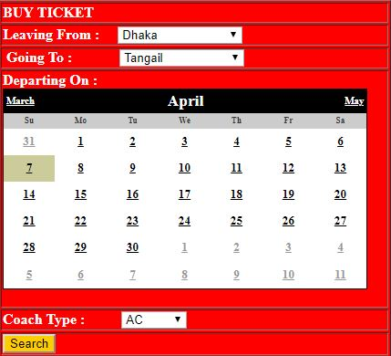
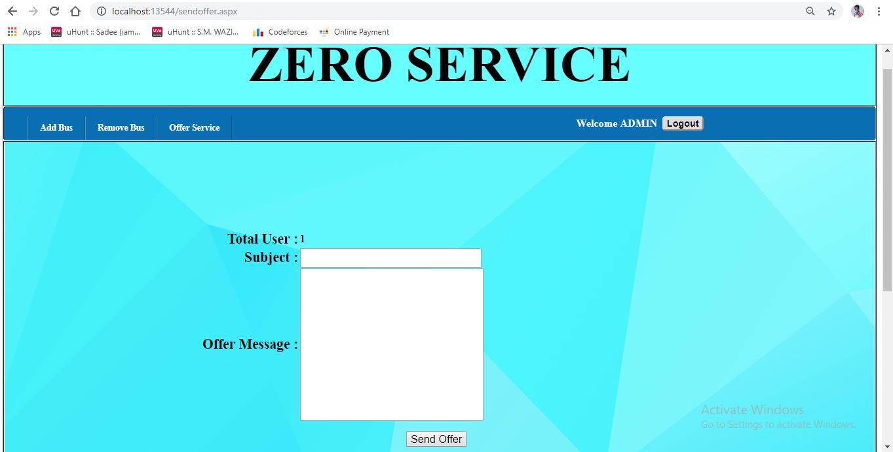

# Online-Bus-Ticket-Management-System

### About The Project
* It is an online bus ticket booking system 
* It is a web based project
* User will be able to book bus ticket
* Both user & website or business owner can easily use the system

### Tools 
* Visual Studio (ASP.NET,C#)
* SQL Server Management Studio
* CSS , HTML

### Features
* Ticket booking with instant PDF copy of ticket
* Special pay card payment system
* Bus add , remove bus option for Admin
* Special offer sent via email in single click for admin
* Forget password option for user through email

### Use-case diagram

### Limitations
* User cannot download PDF of ticket second time
* No option to edit profile of user
* No cancel ticket option

### Screenshots

#### Homepage

#### SignUp Page

#### SignIn Page

#### AfterLogin HomePage

#### Bus Search List

#### Bus List & Filter by Price

#### Select Bus & Pay

#### PDF of Ticket

#### Buy Pay Card from Offer

#### Login as Admin & Add Bus

#### Remove Bus

#### Offer Send through Email All User

#### Forget Password

#### Email after Request Forget Email

#### Contact Us

### Conclusion
Online Bus Ticket Booking System is web based project. It is designed so that user can easily book the ticket with the available admin feature and offer. New feature can be added changing the code & design inside the project.